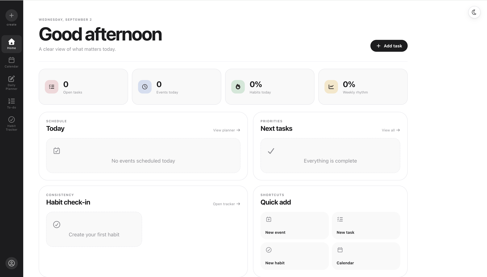

# Planner — Personal Productivity Web Application

Planner is a full-stack personal productivity web application for managing daily events, todos, and habits through a unified dashboard.

## Live Demo

[Open the live application](https://planner-cy.onrender.com)

> The application is deployed using Render, with MySQL hosted on Railway.

---

## Overview

Planner was developed as a personal full-stack web development project.

The application allows users to create an account, securely log in, manage daily events, track todos, and maintain personal habits through a unified productivity dashboard.

User data is stored persistently in a MySQL database, allowing events, todos, habits, and related information to remain available across different login sessions.

The project combines frontend development, REST API integration, authentication, database persistence, backend development, testing, and cloud deployment.

---

## Screenshot

### Dashboard



---

## Features

- User registration and login
- Secure password hashing with bcrypt
- JWT-based user authentication
- User-specific persistent data
- Calendar and daily event management
- Todo creation and tracking
- Habit creation and management
- Habit activity logging
- Interactive personal dashboard
- Persistent storage across login sessions
- Full frontend-backend-database integration

---

## Tech Stack

### Frontend

- HTML5
- CSS3
- JavaScript

### Backend

- Node.js
- Express.js

### Database

- MySQL
- mysql2

### Authentication

- JSON Web Tokens (JWT)
- bcryptjs

### Deployment

- Render
- Railway
- GitHub

### Development Tools

- Git
- GitHub
- Visual Studio Code

---

## Architecture

```text
User Browser
     |
     v
Frontend
HTML / CSS / JavaScript
     |
     v
REST API
Node.js / Express
     |
     v
MySQL Database
Railway
```

The frontend and backend are served through the same Express application.

The browser communicates with REST API endpoints provided by the Node.js and Express backend. The backend handles authentication and application requests and stores persistent user data in MySQL.

---

## Application Structure

```text
Planner_Website_CY_Final/
│
├── Planner_backend/
│   ├── config/
│   ├── controllers/
│   ├── middleware/
│   ├── routes/
│   └── server.js
│
├── Web9/
│   ├── HTML pages
│   ├── CSS files
│   └── JavaScript files
│
├── docs/
│   └── images/
│       └── dashboard.png
│
├── test/
│
├── package.json
├── package-lock.json
├── .gitignore
└── README.md
```

### Main Directories

- `Web9/` — frontend pages, styling, and browser-side JavaScript
- `Planner_backend/` — Express server, API routes, controllers, authentication, and database integration
- `Planner_backend/config/` — backend configuration including MySQL connection settings
- `docs/images/` — screenshots used in the project documentation
- `test/` — automated validation and testing files

---

## API Structure

The backend provides REST API endpoints for the main application features.

### Users

```text
/api/users
```

Handles user registration, login, and authentication-related functionality.

### Events

```text
/api/events
```

Handles calendar events and daily event management.

### Todos

```text
/api/todos
```

Handles todo creation, retrieval, updating, and management.

### Habits

```text
/api/habits
```

Handles habit management and habit-related activity tracking.

---

## Database

The application uses MySQL for persistent data storage.

The main database tables include:

```text
users
events
todos
habits
habit_logs
```

Application data is associated with individual users and retrieved through the backend API.

This allows information to remain available after users log out and log back in.

---

## Key Development Challenge

### Persistent Event Storage

One issue encountered during development was that event information did not initially persist correctly after users logged out and logged back in.

The event management functionality was integrated with the Express backend and MySQL database so that events are stored persistently and associated with individual users.

This changed the data flow from temporary browser-side storage to persistent database-backed storage.

```text
Before

Browser
   |
Temporary Event Data
   |
Logout
   |
Data Lost
```

```text
After

Browser
   |
Express API
   |
MySQL
   |
Persistent User Data
```

This ensured that event information remained available across different login sessions.

---

## Local Development

### 1. Clone the repository

```bash
git clone https://github.com/YangYunshu8/Planner_CY.git
```

Move into the project directory:

```bash
cd Planner_CY
```

### 2. Install dependencies

```bash
npm install
```

### 3. Configure environment variables

Create a `.env` file in the project root.

Example:

```env
PORT=3000

DB_HOST=localhost
DB_PORT=3306
DB_USER=your_mysql_username
DB_PASSWORD=your_mysql_password
DB_NAME=your_database_name

JWT_SECRET=your_long_random_secret
```

Do not commit the `.env` file to GitHub.

### 4. Prepare the MySQL database

Create the required MySQL database and tables before starting the application.

The application requires tables for:

```text
users
events
todos
habits
habit_logs
```

### 5. Start the application

For development:

```bash
npm run dev
```

For production-style startup:

```bash
npm start
```

### 6. Open the application

Open:

```text
http://localhost:3000
```

---

## Testing

Run the automated tests with:

```bash
npm test
```

Backend health can also be checked using:

```text
/api/test
```

Database connectivity can be checked using:

```text
/api/test-db
```

---

## Deployment

The production version of the application uses:

```text
GitHub
   |
   v
Render
Node.js / Express Application
   |
   v
Railway
MySQL Database
```

### Application Hosting

The Node.js and Express application is deployed on Render.

### Database Hosting

The MySQL database is hosted on Railway.

Sensitive production credentials are configured using environment variables rather than being stored in the GitHub repository.

---

## Security Practices

The project includes several basic security practices:

- Passwords are hashed using bcrypt
- Authentication uses JSON Web Tokens
- Database credentials are stored in environment variables
- `.env` is excluded from Git
- `node_modules` is excluded from Git
- IDE-specific configuration files are excluded from Git
- Database credentials are not stored directly in source code

---

## Development Process

This project was developed as an independent personal project.

AI-assisted development tools were used during parts of implementation, debugging, code review, and refinement.

The overall project involved defining application requirements, making feature decisions, integrating frontend and backend functionality, testing application behaviour, debugging persistence issues, configuring the database, and deploying the completed system.

---

## Future Improvements

Potential future improvements include:

- Schedule conflict detection
- Deadline prioritisation
- Weekly productivity statistics
- Productivity analytics dashboard
- Calendar export functionality
- Improved responsive design for mobile devices
- Improved accessibility
- Email reminders and notifications
- Password reset functionality
- Additional automated testing
- Improved API validation and error handling

---

## Repository

GitHub:

[YangYunshu8/Planner_CY](https://github.com/YangYunshu8/Planner_CY)

---

## Author

Developed as a personal full-stack web development project.